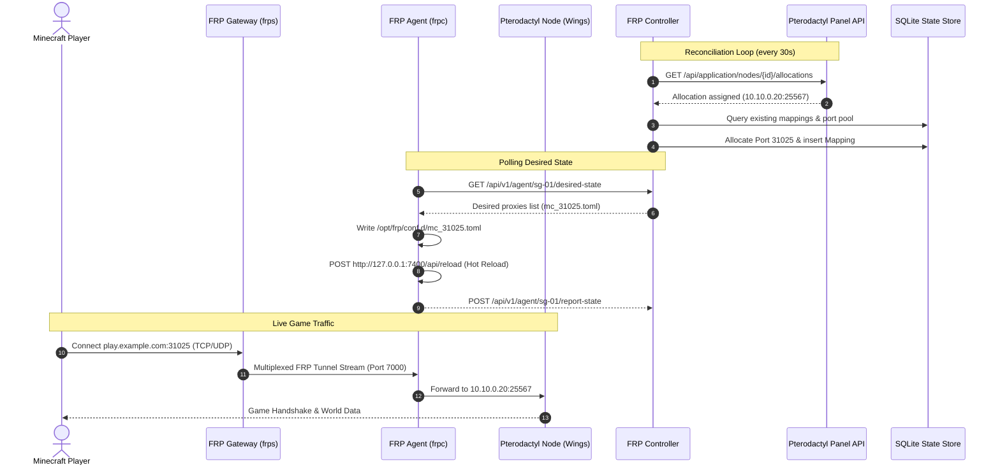

# Architecture Guide — FRP Gateway Orchestrator

## 1. System Philosophy & Core Design Principles

The FRP Gateway Orchestration System is built upon three foundational tenets:

1. **The Central Controller is the Single Source of Truth**: Agents and gateways do not invent mappings independently. Desired state is computed centrally from Pterodactyl allocations, persisted in a transactional SQLite store, and continuously converged.
2. **Zero-Downtime Hot Reloading**: Creating, updating, or deleting one Minecraft server mapping must never disconnect or degrade active sessions on other ports.
3. **Complete Backend Node Privacy**: Customer-facing FQDNs and IP addresses always resolve to FRP Gateways. Backend Pterodactyl node addresses remain unexposed.

---

## 2. Component Topology & Data Flow



---

## 3. Zero-Downtime FRP Reload Mechanics

### The Anti-Pattern (Restarting FRP)
```
New Server Created ──► Rewrite monolithic frpc.toml ──► Restart frpc ──► ALL active players disconnected!
```

### The Production Solution (Multi-File Split + Admin API Reload)
Modern FRP (v0.50+) provides `includes` directives and an embedded HTTP administrative server (`/api/reload`).

1. **Base Configuration (`/opt/frp/frpc.toml`)**:
   ```toml
   serverAddr = "3.108.50.20"
   serverPort = 7000
   auth.method = "token"
   auth.token = "secure-token"
   transport.tls.enable = true

   webServer.addr = "127.0.0.1"
   webServer.port = 7400
   webServer.user = "admin"
   webServer.password = "admin-password"

   includes = ["/opt/frp/conf.d/*.toml"]
   ```

2. **Per-Allocation Proxy Blocks (`/opt/frp/conf.d/mc_<mapping_id>.toml`)**:
   ```toml
   [[proxies]]
   name = "mc_srv_101_tcp"
   type = "tcp"
   localIP = "10.10.0.20"
   localPort = 25565
   remotePort = 31025
   ```

3. **Dynamic Reload**:
   When a new file is added or removed from `conf.d/`, the agent sends an authenticated HTTP request to `http://127.0.0.1:7400/api/reload`.
   - Unchanged proxy streams remain completely open and uninterrupted.
   - New proxies are registered with `frps`.
   - Deleted proxies are gracefully terminated.

---

## 4. Persistent Port Allocation Engine

The Port Allocation Engine (`PortManager`) provides independent tracking for TCP and UDP port bitmaps:

```
Gateway Port Range: 30000 - 40000

TCP Pool: [ 30000 (Reserved) | 30001 (Server A) | 30002 (Geyser TCP) | 30003 (Free) ... ]
UDP Pool: [ 30000 (Reserved) | 30001 (Server C) | 30002 (Geyser UDP) | 30003 (Free) ... ]
```

### Dual-Protocol (`Both`) Port Allocation
When a server requires `Protocol::Both` (such as GeyserMC crossplay), the allocator scans for a port number `P` that is simultaneously available in **both** the TCP pool and the UDP pool.
If Server A already occupies TCP 30001, Geyser cannot take 30001; it will be assigned 30002 for both TCP and UDP.

---

## 5. Protocol Auto-Detection Rules

The Controller evaluates protocol requirements in order of precedence:

1. **Administrator Override**: Explicit protocol set in DB or via CLI.
2. **Egg Overrides**: Exact match from `pterodactyl.egg_protocol_overrides` map in `controller.toml`.
3. **Metadata Pattern Match**:
   - `geyser` or `floodgate` in server name / egg name / docker image ──► **Both (TCP + UDP)**
   - `bedrock`, `nukkit`, `pocketmine`, `powernukkit` ──► **UDP**
4. **Default Fallback**: **TCP** (Minecraft Java standard).

---

## 6. Self-Healing & Reboot Recovery

1. **Controller Reboot**:
   - Reads database schema and tables from WAL SQLite store.
   - Syncs configured gateways.
   - Starts periodic reconciliation and REST API. Active tunnels remain unaffected during controller downtime.

2. **Gateway Reboot**:
   - Systemd automatically restarts `frps`.
   - Agents detect tunnel disconnect and re-establish authenticated connection with backoff.
   - Mappings resume automatically.

3. **Node / Agent Reboot**:
   - `frpc` and `frp-agent` systemd units start.
   - Agent pulls desired state from Controller (`GET /api/v1/agent/:id/desired-state`).
   - Agent writes all active `conf.d/*.toml` configs and signals `frpc` to connect to Gateway.
