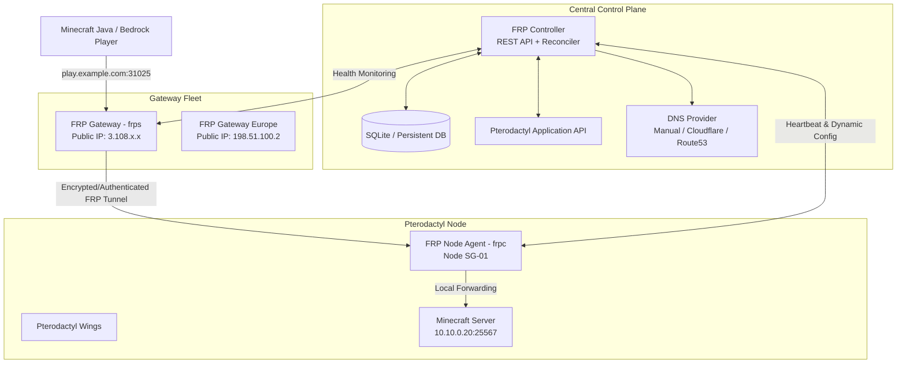

# FRP Orchestrator — Automated Gateway System for Pterodactyl & Minecraft

[](https://github.com/UG88/frp-orchestrator/actions)
[](https://opensource.org/licenses/MIT)

**FRP Orchestrator** is a production-ready, zero-downtime gateway orchestration system designed specifically for Minecraft hosting providers operating on [Pterodactyl](https://pterodactyl.io).

It establishes an automated, encrypted networking layer that connects external players to backend Pterodactyl nodes via an elastic fleet of Fast Reverse Proxy (FRP) gateways. Backend node IP addresses are kept completely private and are never exposed to customers.

---

## Architecture Overview



---

- **Native Real Player IP Forwarding**: Supports both **WireGuard Transparent Kernel Ingress** (native real player IPs with zero plugins across all game flavors) and **FRP PROXY Protocol v2**.
- **Zero-Downtime Hot Reloading**: Uses FRP's multi-file configuration (`conf.d/*.toml`) and admin reload API. Adding, modifying, or removing a server never interrupts existing active Minecraft sessions.
- **Hidden Node Topology**: Players connect to the Gateway IP or FQDN. The backend node's public IP remains completely unexposed.
- **Protocol Intelligence**:
  - `tcp`: Standard Minecraft Java Edition.
  - `udp`: Bedrock standalone / PocketMine.
  - `both`: GeyserMC & Floodgate crossplay servers (TCP and UDP mapped simultaneously to the same public gateway port).
  - `auto`: Automatic egg / docker image detection with manual administrator overrides.
- **State Reconciliation**: Continuous 3-way reconciliation between Pterodactyl Panel, Controller DB, and FRP Agents. Automatically creates missing tunnels, purges obsolete allocations, and reclaims ports.
- **Persistent Port Allocation Engine**: Separate TCP and UDP port bitmaps, reserved range exclusions, conflict avoidance, and instant port reclamation upon server deletion.
- **Multi-Gateway & Regional Routing**: Nodes map to specific regional gateways (e.g. Singapore, India, Germany) with health monitoring and failover.
- **Built-in DNS Management**: Automated FQDN provisioning (`srv-<id>.domain` or `<alias>.domain`). Supports Cloudflare (disabled by default; easily enabled via config), Route53, and manual modes.
- **CLI & Diagnostic Suite (`frpctl`)**: Unified CLI tool for installation, cluster monitoring, manual mappings, and self-healing diagnostic (`frpctl doctor`).

---

## Component Layout

| Component | Binary | Description |
|---|---|---|
| **Controller** | `frp-controller` | Central orchestrator, REST API, SQLite state store, port allocator, and reconciler |
| **Agent** | `frp-agent` | Daemon installed on Pterodactyl nodes. Manages `frpc` multi-file configuration and hot reloads |
| **Gateway** | `frp-gateway` | Daemon installed on FRP Gateway servers. Manages `frps`, telemetry, and firewall rules |
| **CLI** | `frpctl` | Unified administrator CLI and diagnostic utility |

## Quick Setup Cheat Sheet — Where to Get Information

Before starting, obtain these values:

| Parameter | How to Get / Where to Find |
|---|---|
| **Pterodactyl Panel URL** | Base HTTPS address of your panel (e.g. `https://panel.example.com`). |
| **Pterodactyl Application API Key** | In Pterodactyl: **Admin Panel** ──► **Application API** ──► **Create New** ──► Enable `Nodes (Read)`, `Servers (Read)`, `Allocations (Read)`. Key starts with `ptla_...`. |
| **Pterodactyl Node ID** | In Pterodactyl: **Admin Panel** ──► **Nodes** ──► Click your node name. Look at the ID shown in the header/URL (e.g. `Singapore-01 (#1)` ──► Node ID is `1`). |
| **Gateway Public IP** | On your Gateway VPS, run: `curl -s ifconfig.me`. |
| **Secret Tokens** | Run `openssl rand -hex 32` in your terminal to generate 64-char random tokens. |

---

## Quick Start (Direct Role-Based Installation)

### 1. Central Controller Server
```bash
# Automated installer
curl -fsSL https://raw.githubusercontent.com/UG88/frp-orchestrator/main/scripts/install-controller.sh | sudo bash

# Run interactive configuration wizard
frpctl init controller

# Start service
sudo systemctl enable --now frp-controller
```

### 2. Public Gateway Server(s)
```bash
# Automated installer (sets up frps and hardened firewall)
curl -fsSL https://raw.githubusercontent.com/UG88/frp-orchestrator/main/scripts/install-gateway.sh | sudo bash

# Run interactive configuration wizard
frpctl init gateway

# Start service
sudo systemctl enable --now frps
```

### 3. Pterodactyl Node Server(s) (Installed alongside Wings)
```bash
# Automated installer (sets up frpc and agent daemon)
curl -fsSL https://raw.githubusercontent.com/UG88/frp-orchestrator/main/scripts/install-agent.sh | sudo bash

# Run interactive configuration wizard
frpctl init agent

# Start services
sudo systemctl enable --now frpc frp-agent
```

### 4. Verify Everything with `frpctl doctor`
```bash
frpctl doctor
```

Output:
```
FRP Orchestrator Doctor Diagnostic
==================================
[✓] Operating System & Architecture
    Details: OS: linux, Arch: amd64

[✓] FRP Binary Check
    Details: Found FRP executable at /opt/frp/frpc

[✓] Controller API Connectivity
    Details: Connected to Controller v0.1.0 (Uptime: 142s, DB: OK)

[✓] Gateway Cluster Status
    Details: Gateways online: 1/1 healthy

[✓] Pterodactyl Nodes Status
    Details: Nodes connected: 1/1 healthy (Active mappings: 2)

Result: All checks PASSED! System is ready.
```

---

## CLI Reference

```bash
# Gateway inspection
frpctl gateway list
frpctl gateway status gw-sg-01

# Node & Agent inspection
frpctl agent list
frpctl agent status agent-sg-node-01

# Allocations & Mappings
frpctl allocation list
frpctl mapping list
frpctl mapping create --node-id node-sg-01 --allocation-id alloc-101 --local-ip 10.10.0.20 --local-port 25565 --protocol both
frpctl mapping delete <mapping-id>

# Port pool metrics
frpctl port list

# Trigger immediate reconciliation
frpctl reconcile

# Cluster health report
frpctl health
```

---

## Documentation

- [**WIREGUARD.md**](file:///WIREGUARD.md) — Transparent kernel tunneling setup guide (100% native real player IPs, zero plugins).
- [**INSTALLATION.md**](file:///INSTALLATION.md) — Complete setup guide for Gateways, Agents, Controllers, and Firewalls.
- [**ARCHITECTURE.md**](file:///ARCHITECTURE.md) — Deep architectural dive, reconciliation flow, and zero-downtime mechanics.
- [**CONFIGURATION.md**](file:///CONFIGURATION.md) — Complete configuration specification for all components.
- [**SECURITY.md**](file:///SECURITY.md) — Security model, token hashing, firewall rules, and systemd hardening.
- [**TROUBLESHOOTING.md**](file:///TROUBLESHOOTING.md) — Diagnostic guides and common error resolutions.
- [**CONTRIBUTING.md**](file:///CONTRIBUTING.md) — Guidelines for contributing and running local test environments.

---

## License

This project is licensed under the MIT License — see the [LICENSE](file:///LICENSE) file for details.
